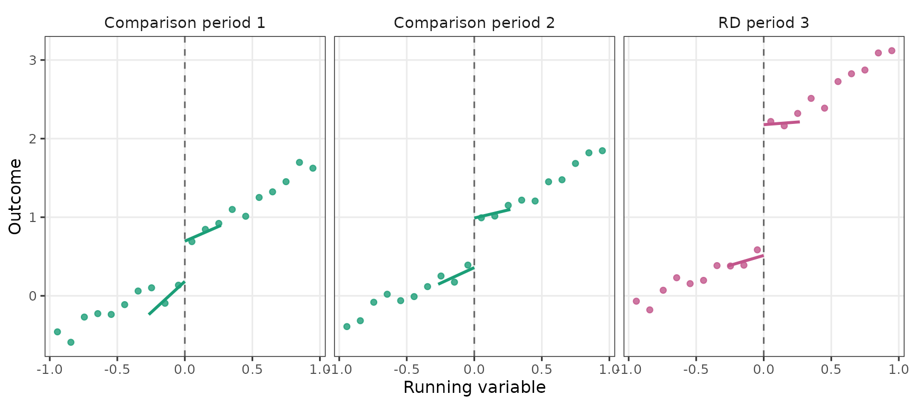
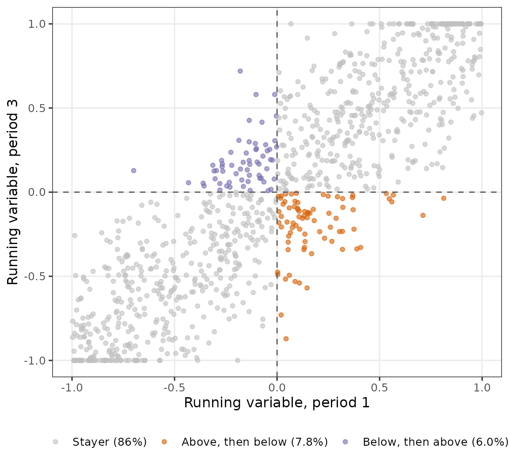
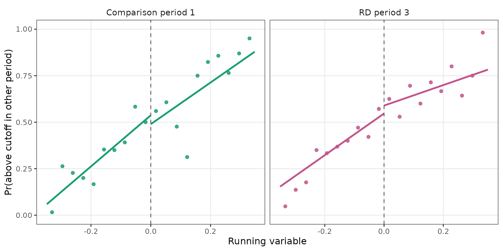
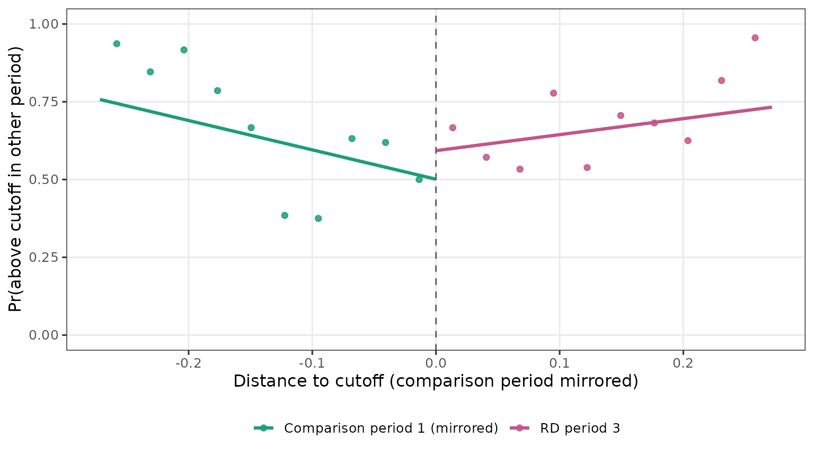
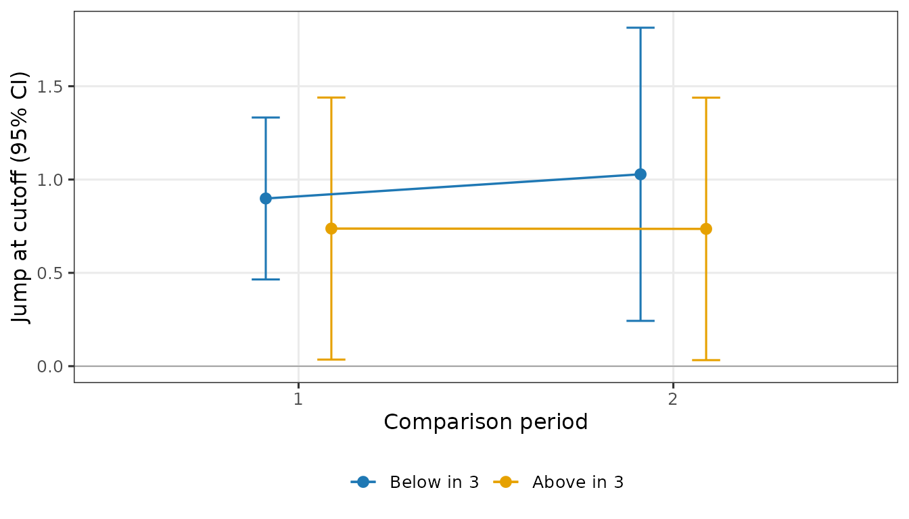
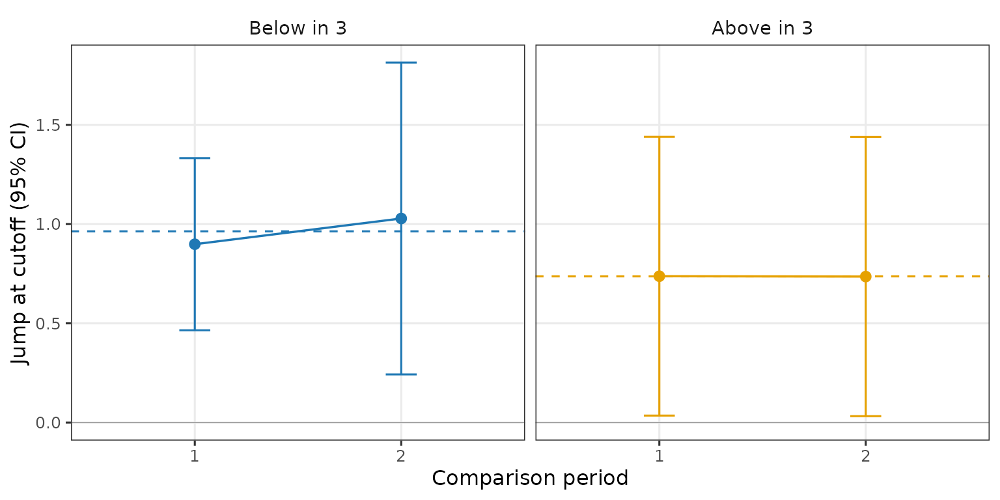
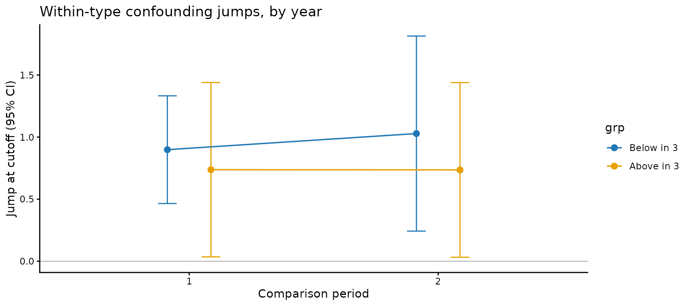

# Pictures of the checks

Every object the package returns can be drawn with
[`plot()`](https://rdrr.io/r/graphics/plot.default.html). The pictures
follow the validation figures of the paper’s application: the
local-linear fits that the estimate and the tests are made of, shown on
the data, so that a rejection (or a non-rejection) can be read off the
figure and not only off a p-value. They are ggplot objects, so they can
be changed with the usual `+` (a title, a theme, limits) and saved with
[`ggplot2::ggsave()`](https://ggplot2.tidyverse.org/reference/ggsave.html).
ggplot2 is only suggested by the package; the plot functions ask for it
when it is missing.

``` r

library(rddid)
library(ggplot2)
```

## The estimate: one RD plot per period

``` r

fit <- rddid(rddid_sim, y = "Y", x = "R", time = "year", id = "id", t_rd = 3)
plot(fit)
```



One panel per period, in time order. The points are the outcome averaged
within 20 equal-width bins of the running variable; the two lines are
the local-linear fits on each side of the cutoff, drawn over the
bandwidth the estimate used (`summary(fit)` lists the bandwidth and
every jump). The vertical distance between the two lines at the cutoff
is the period’s jump $`D_t`$. The RD-DID estimate is the RD-period jump
minus the weighted comparison-period jumps: here the confounding jump of
about 0.5 shows up in years 1 and 2, and the year-3 jump of about 1.5 is
the effect plus the confounding jump. The figures carry no titles or
statistics by design: the numbers are in the printed objects, and a
title is one `+ labs()` away (last section).

## Who switches side: the running variable in two periods

``` r

plot_switchers(rddid_sim_pv, x = "R", time = "year", id = "id", periods = c(1, 3))
```



Each unit observed in both periods is a point; the dashed lines are the
cutoff. The units in the off-diagonal quadrants changed side of the
cutoff between the two periods: these “switchers” are what the four
tests below are about. With a running variable fixed over time
(`rddid_sim`) every point lies on the diagonal and the quadrants are
empty.

## Type continuity

``` r

tc <- rd_typecont(rddid_sim_pv, x = "R", time = "year", id = "id", t_rd = 3)
plot(tc, comparison = 1)
```



The paper’s type-continuity figure, for one comparison period and the RD
period. Left panel: in the comparison period, the share of units that
are above the cutoff in the RD period, against the comparison-period
running variable. Right panel: in the RD period, the share that are
above the cutoff in the comparison period. The points are binned shares
inside the bandwidth; the lines are the local-linear fit on each side of
the cutoff, at the bandwidth rule the test used. Under the null the two
lines of a panel meet at the cutoff: who a unit is in the other period
does not jump at the cutoff. The test’s statistic is in `print(tc)`;
with three or more periods the test uses the full pattern of a unit’s
sides in the other periods, so the picture is the pairwise version, one
pair at a time (`plot(tc, comparison = 2)` draws the other pair).

## Composition stability

``` r

cs <- rd_compstable(rddid_sim_pv, x = "R", time = "year", id = "id", t_rd = 3)
plot(cs)
```



The paper’s reflected-sample construction. The units above the cutoff in
the comparison period are placed to the **left** of an artificial cutoff
at their mirrored distance $`-(R_{t_0} - c)`$; the units above the
cutoff in the RD period are placed to the **right** at
$`R_{t_{RD}} - c`$. The outcome is whether the unit is above the cutoff
in the other period of the pair; the binned share and the local-linear
fit on each side are drawn. Under the null the two lines meet at the
artificial cutoff: the units just above the cutoff are the same mix in
both periods. In `rddid_sim_pv` the assumption fails by construction and
the pair’s test rejects (`print(cs)`); with three periods that test also
uses the unit’s side in the third period, which the binary picture does
not show, so the gap here is smaller than the statistic suggests.
`plot(cs, pair = 2)` draws the next pair; under `estimand = "atu"` the
same picture is drawn for the units below the cutoff.

## Homogeneous confounding

``` r

hg <- rd_homog(rddid_sim_pv, y = "Y", x = "R", time = "year", id = "id", t_rd = 3)
plot(hg)
```



In a comparison period the jump in the outcome at the cutoff is the
confounding jump. The plot shows that jump, estimated within each type
(by default the unit’s side in the RD period: “Below in 3” and “Above in
3”), with its 95% interval, for each comparison period. Under the null
the types’ points coincide within a period, up to sampling error. In
`rddid_sim_pv` the confounding jump is 0.5 for every unit, so the two
types agree in both years.

## Constant within-type confounding

``` r

tr <- rd_trendcell(rddid_sim_pv, y = "Y", x = "R", time = "year", id = "id", t_rd = 3)
plot(tr)
```



The same within-type jumps, read the other way: one panel per type, its
jump in each comparison period, and a dashed line at the type’s average.
Under the null (`trend = "constant"`) the points of a panel sit on the
dashed line, up to sampling error; a drift across periods would call for
`rddid(trend = "linear")`, and `rd_trendcell(trend = "linear")` then
tests whether the drift is itself linear (three or more comparison
periods are needed for that).

## Changing a plot

The functions return ggplot objects, so the usual tools apply:

``` r

plot(hg) + labs(title = "Within-type confounding jumps, by year") + theme_classic()
```



## References

Leventer, D. and D. Nevo (2024). Correcting Invalid Regression
Discontinuity Designs Using Multiple Time-Period Data. arXiv:2408.05847.
<https://arxiv.org/abs/2408.05847>
